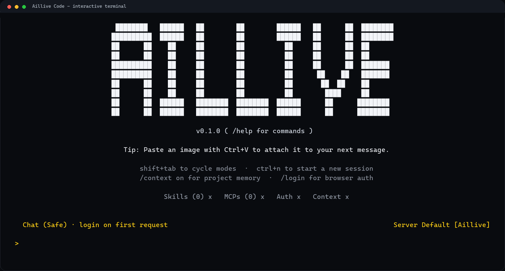

<div align="center">

# Aillive Code


**Aillive Code：用于对话、Agent、API 和项目工作的终端 AI 助手。**

中文 | [English](README.md)

[Website](https://www.aillive.xyz) | [Docs](https://www.aillive.xyz/docs/) | [GitHub](https://github.com/amine123max/Aillive-Code)

</div>

Aillive Code 是 Aillive 的独立 npm CLI。它把 Aillive 对话、项目上下文、OpenAI 兼容 API、OpenClaw 任务、用量查询、本地会话和专业终端界面整合到一个命令里。

这个仓库用于发布 npm 包 `aillive-code`。安装后可使用两个命令：

- `aillive`
- `aillive-code`

产品结构参考成熟 AI Coding CLI 的开发者体验：快速安装、浏览器登录、slash commands、项目记忆、单次执行、本地配置和适合 CI 的 JSON 输出。Aillive Code 保留自己的命令命名、认证流程、API 协议和本地目录结构。

## 快速开始

npm 发布后可这样安装：

```bash
npm install -g aillive-code
aillive --version
aillive auth login
aillive doctor
aillive
```

免安装运行：

```bash
npx aillive-code chat "Hello Aillive"
```

npm 发布前，可以直接从 GitHub 安装：

```bash
npm install -g github:amine123max/Aillive-Code
aillive --help
```

从本地仓库安装：

```bash
git clone https://github.com/amine123max/Aillive-Code.git
cd Aillive-Code
npm install -g .
aillive doctor
```

## 终端体验

在任意项目目录运行 `aillive` 即可进入交互式终端。



未登录时也可以打开终端。Aillive Code 只会在真正需要 API 的动作中触发浏览器认证，例如 chat、models、usage 或 OpenClaw。

常用 slash commands：

```text
/help        查看交互命令
/status      查看 auth、model、context、home、authFile、workspace
/login       打开浏览器登录，回调自动保存 ~/.aillive/auth.json
/models      列出服务端模型
/context     查看项目上下文状态
/context on  为当前终端会话附加项目记忆
/usage       查看账号用量
/doctor      检查本地配置和 API 可用性
/sessions    查看本地 CLI 会话
/clear       清空当前终端上下文
/exit        退出
```

也支持脚本和快速提问：

```bash
aillive "总结这个项目"
aillive chat --stream "写一个发布 checklist"
aillive run --project "生成简洁的 README 大纲"
```

## 认证

推荐使用浏览器登录：

```bash
aillive auth login
```

浏览器回调会自动写入 `~/.aillive/auth.json`。登录过程中请保持终端打开，直到 Aillive 打印认证成功信息。

```bash
aillive auth status
aillive auth path
```

CI 环境可以使用环境变量：

```bash
set AILLIVE_API_KEY=ail_xxx
set AILLIVE_BASE_URL=https://www.aillive.xyz/api/v1
aillive chat --json "Hello"
```

本地配置命令：

```bash
aillive config set base-url https://www.aillive.xyz/api/v1
aillive config set api-key ail_xxx
aillive config set model qwen2.5:0.5b
aillive config list
```

API Key 和 auth 文件属于敏感信息，请勿提交到 GitHub。

## 本地文件

Aillive Code 会把用户级配置存放在电脑用户目录：

```text
~/.aillive/
  auth.json
  config.json
  stats.json
  sessions/
    index.json
  checkpoints/
    index.json
  traces/
    index.json
  projects/
    <project-key>/
      project.md
```

Windows 上可以直接打开目录：

```bash
aillive home
aillive home --open
```

项目上下文存放在 `~/.aillive/projects/<project-key>/project.md`。CLI 不会自动上传本地文件内容，只有显式启用时才会发送项目上下文：

```bash
aillive init
aillive context path
aillive context show
aillive run --project "总结当前项目"
```

## 命令

| 模块 | 命令 |
| --- | --- |
| 启动 | `aillive`, `aillive interactive`, `aillive setup`, `aillive doctor` |
| 认证 | `aillive auth login`, `aillive auth import`, `aillive auth status`, `aillive logout` |
| 对话 | `aillive ask`, `aillive chat`, `aillive chat --stream`, `aillive "prompt"` |
| Agent | `aillive agent plan "task"`, `aillive agent run "task"`, `aillive agent run --verify "task"`, `aillive agent verify`, `aillive agent resume [checkpoint]` |
| 项目 | `aillive init`, `aillive run --project`, `aillive context status/show/path/init` |
| 模型 | `aillive models` |
| 用量 | `aillive usage --from 2026-07-01 --to 2026-07-31 --json` |
| OpenClaw | `aillive openclaw run "生成微信客服自动回复流程"` |
| 本地 | `aillive home`, `aillive session list`, `aillive stats` |
| 架构 | `aillive runtime status`, `aillive provider status`, `aillive mcp status`, `aillive lsp status`, `aillive git status`, `aillive memory status` |
| Shell | `aillive completions powershell`, `aillive completions bash`, `aillive completions zsh` |
| 管理 | `aillive admin promote admin@example.com --data-dir "../Web/data"` |

## 开发

Aillive Code 现在按 npm workspace 组织，同时仍由根包发布 `aillive-code` npm 包。可执行 CLI app 位于 `apps/cli`，根目录 `src/index.js` 保留为兼容 shim，方便旧测试和旧导入路径继续工作。

```text
apps/cli              CLI app 和命令入口
packages/core         config、path、parser、error、formatting 等共享工具
packages/tui          终端渲染和交互式 UI primitives
packages/provider     Aillive 与 OpenAI-compatible Provider client
packages/mcp          MCP registry 和 tool invocation contracts
packages/lsp          Language Server integration contracts
packages/git          Git 仓库检查和 checkpoint metadata
packages/memory       本地 sessions、stats、project memory 和 checkpoint
packages/agent-runtime planning、tool routing、verification 和 task trace
```

第一批架构改造只建立包边界，并保持现有命令行为不变。
架构状态命令同时支持 human 和 JSON 模式，便于在深入 Agent 执行前检查 subsystem readiness。
稳定工具层已经开始进入 packages：Core 负责 config/path/parser/JSON/auth helpers，TUI 负责终端渲染工具，Memory 负责本地 sessions、stats 和 project context stores。
Provider 调用已经由 `packages/provider` 承担：模型列表、标准化模型元数据、chat completion、SSE streaming、usage、OpenClaw task、timeout/retry policy、状态检查和脱敏 request trace。
Git、LSP 和 Agent Runtime 现在也具备可离线测试的核心契约：只读仓库检查、mock JSON-RPC 代码智能、带 trace/checkpoint event 的 Agent 状态机。
`aillive agent plan|run|resume` 会离线运行这套 runtime，将 checkpoint/trace memory 写入 `~/.aillive`，无需浏览器登录即可安全执行。`aillive agent verify` 和 `aillive agent run --verify` 会运行配置的 syntax、test 和 pack-smoke verification hooks。
Aillive MCP 对外暴露自己的 Aillive tool contract。底层仅把一个 MIT 第三方 contract 包作为内部实现来源复用；公开 API 命名、命令、认证、协议和本地数据布局都保持 Aillive 自有体系。
Agent runtime 也内置安全门：破坏性 shell 命令、包含 secret 的 trace、大文件编辑、dirty Git worktree 和高风险 MCP 工具都会按策略拒绝或要求确认。

```bash
npm install
npm run check
npm run check:release
npm test
npm run smoke:npx
npm run pack:smoke
npm run pack:dry
npm run publish:check
```

`npm run check:release` 会检查发布元数据、changelog 版本覆盖、bin alias、package files allowlist 和发布文档。
`npm run pack:smoke` 会创建临时 npm tarball、检查 tarball 文件清单、启动 mock Aillive API，并通过 npm 执行路径验证 `aillive` 和 `aillive-code`。`npm run smoke:npx` 保留为同一 pack smoke 的兼容别名。

## 发布

npm 包名是 `aillive-code`。

发布前：

```bash
npm whoami
npm run check:release
npm run pack:smoke
npm run publish:check
npm publish
```

如果 `npm whoami` 失败，先登录：

```bash
npm adduser
```

发布后用户可以安装：

```bash
npm install -g aillive-code
npx aillive-code chat "Hello"
```

## GitHub 发布清单

1. 确认 `package.json` 版本。
2. 确认 `CHANGELOG.md` 有同版本标题。
3. 运行 `npm run publish:check`。
4. 确认 `npm pack --dry-run` 只包含 CLI app、兼容 shim、内部包、docs assets、README、LICENSE 和 package metadata。
5. 推送 `main`。
6. 创建类似 `v0.1.0` 的 GitHub release tag。
7. npm 登录后发布。

手动触发的 GitHub Actions `Release` workflow 会运行 `npm run publish:check` 并生成 tarball artifact，默认不会发布。只有在确认要发布 npm 且已配置 `NPM_TOKEN` 时，才把 `publish_to_npm` 设置为 `true`；workflow 会使用 npm provenance 发布。

## 安全

- 不要提交 `.env`、`auth.json`、API Key、Provider Key、本地数据库、日志或 `.aillive/`。
- API Key 泄露后请立即在 Aillive Console 撤销。
- 本地开发、CI、生产环境建议使用不同 API Key。
- 自动化场景建议使用 `--json`，避免在日志中打印敏感信息。

## 许可证

MIT
